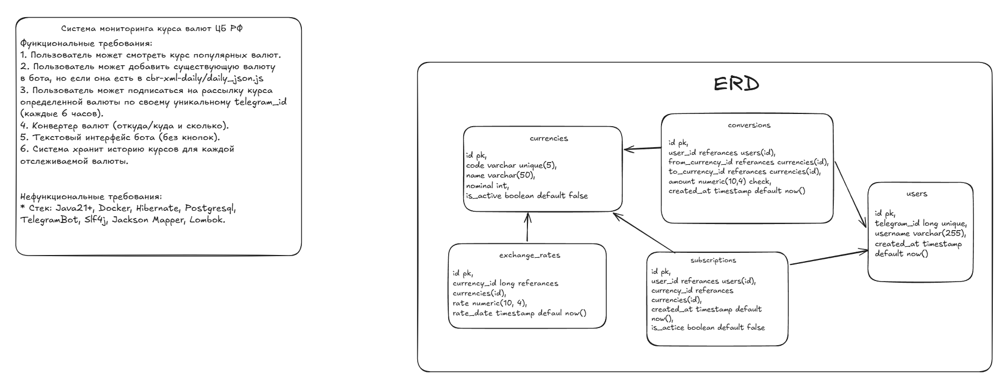

# Информация по проекту

# Функциональные требования:

* Пользователь может смотреть курс популярных валют.
* Пользователь может добавить существующую валюту
  в бота, но если она есть в [cbr-api](https://www.cbr-xml-daily.ru/daily_json.js)
* Пользователь может подписаться на рассылку курса
  определенной валюты по своему уникальному `telegram_id`
  (каждые 6 часов).
* Конвертер валют (откуда/куда и сколько).
* Текстовый интерфейс бота (без кнопок).
* Система хранит историю курсов для каждой
  отслеживаемой валюты.

# Нефункциональные требования:

* Стек: Java21+, Docker, Hibernate, Postgresql,
  TelegramBot, Slf4j, Jackson Mapper, Lombok.

https://excalidraw.com/#json=iCmPICVKQLD8XgLpTgXEl,sQ_EMt5GrAWRbETsk9h9hA

